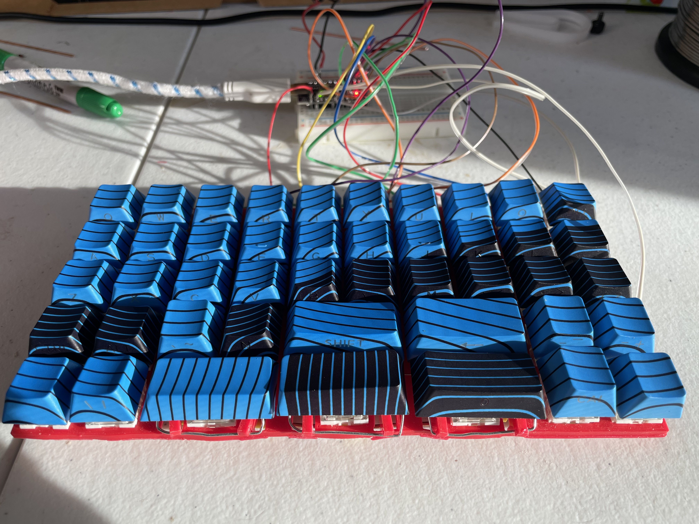
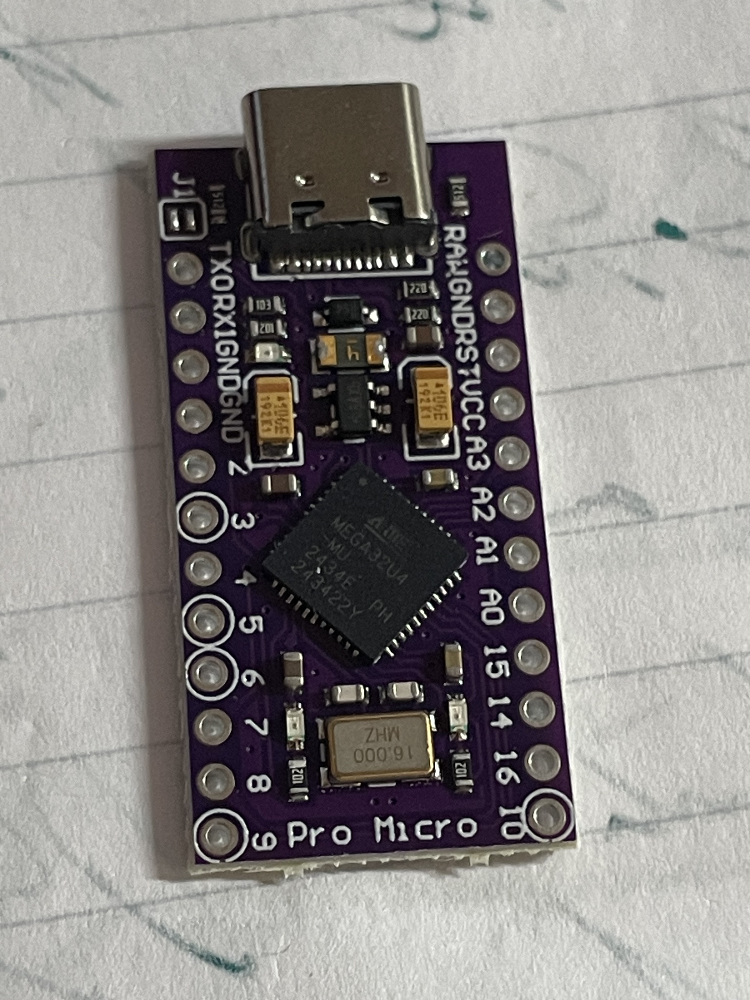
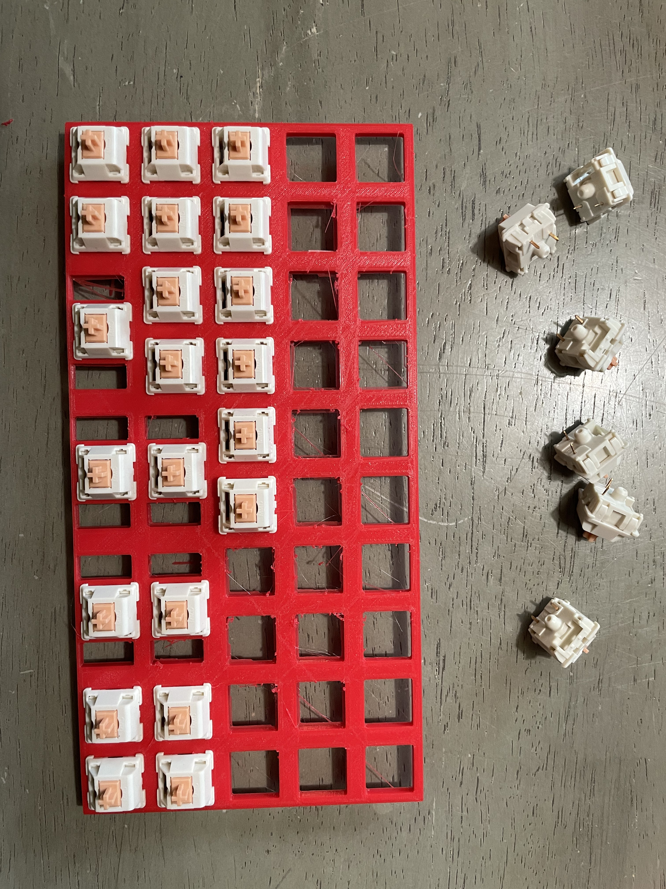
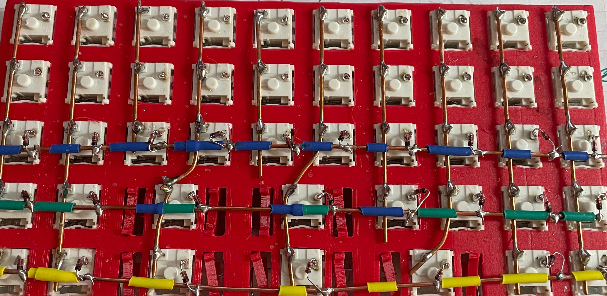

# Weyland-Yutani Nostromo Custom Keyboard

A custom 45-key mechanical keyboard with QMK firmware, inspired by the iconic spacecraft from the Alien franchise.



## Features

- **45-key layout** with 2u stabilized keys for Tab, Backspace, Shift, Space, and Return
- **3 layers** accessible via dual function keys
- **Pro Micro** based (ATmega32U4)
- **QMK firmware** with full customization support
- **Handwired** construction with 1N4148 diodes

## Layout

### Base Layer (Layer 0)
```
┌───┬───┬───┬───┬───┬───┬───┬───┬───┬───┐
│ Q │ W │ E │ R │ T │ Y │ U │ I │ O │ P │
├───┼───┼───┼───┼───┼───┼───┼───┼───┼───┤
│ A │ S │ D │ F │ G │ H │ J │ K │ L │ ; │
├───┼───┼───┼───┼───┼───┼───┼───┼───┼───┤
│ Z │ X │ C │ V │ B │ N │ M │ , │ . │ / │
├───┼───┼───┼───┼───────┼───────┼───┼───┤
│Ctl│Alt│ ` │ \ │Tab 2u │Bksp2u │ ' │ = │
├───┼───┼───────┼───────┼───────┼───┼───┤
│Fn1│Sys│Shift2u│Space2u│Return2│Fn2│Esc│
└───┴───┴───────┴───────┴───────┴───┴───┘
```

### Layer 1: Numbers & Navigation (Hold LEFT Fn1)
```
┌───┬───┬───┬───┬───┬───┬───┬───┬───┬───┐
│ 1 │ 2 │ 3 │ 4 │ 5 │ 6 │ 7 │ 8 │ 9 │ 0 │
├───┼───┼───┼───┼───┼───┼───┼───┼───┼───┤
│   │   │   │   │   │ ← │ ↓ │ ↑ │ → │Del│
├───┼───┼───┼───┼───┼───┼───┼───┼───┼───┤
│   │   │   │   │   │Hom│PgD│PgU│End│Ins│
├───┼───┼───┼───┼───────┼───────┼───┼───┤
│   │   │   │   │       │  Del  │ [ │ ] │
├───┼───┼───────┼───────┼───────┼───┼───┤
│Fn1│   │       │       │       │   │   │
└───┴───┴───────┴───────┴───────┴───┴───┘
```

Features:
- **Numbers:** Top row becomes 1-0
- **Arrow keys:** HJKL (vim-style: H=←, J=↓, K=↑, L=→)
- **Navigation:** Home, End, Page Up, Page Down
- **Extras:** Delete, Insert, Brackets [ ]

### Layer 2: Function Keys & Media (Hold RIGHT Fn2)
```
┌───┬───┬───┬───┬───┬───┬───┬───┬───┬───┐
│F1 │F2 │F3 │F4 │F5 │F6 │F7 │F8 │F9 │F10│
├───┼───┼───┼───┼───┼───┼───┼───┼───┼───┤
│F11│F12│   │   │   │Prv│VoD│VoU│Nxt│Mut│
├───┼───┼───┼───┼───┼───┼───┼───┼───┼───┤
│   │   │   │   │   │Stp│Ply│Pau│   │   │
├───┼───┼───┼───┼───────┼───────┼───┼───┤
│   │   │   │   │       │       │ - │ + │
├───┼───┼───────┼───────┼───────┼───┼───┤
│   │   │       │       │       │Fn2│Rst│
└───┴───┴───────┴───────┴───────┴───┴───┘
```

Features:
- **Function keys:** F1-F12
- **Media controls:** Play/Pause, Next, Previous, Stop
- **Volume:** Volume Up/Down, Mute
- **Special:** QK_BOOT (Rst) for firmware flashing

## Hardware

### Required Components
- 1x Pro Micro (or compatible ATmega32U4 board)
- 45x Cherry MX compatible switches
- 45x 1N4148 diodes
- Wire for matrix
- USB cable
- Case/mounting solution

### Matrix Layout (5x10)
```
        Col0  Col1  Col2  Col3  Col4  Col5  Col6  Col7  Col8  Col9
Row0    Q     W     E     R     T     Y     U     I     O     P
Row1    A     S     D     F     G     H     J     K     L     ;
Row2    Z     X     C     V     B     N     M     ,     .     /
Row3    Ctrl  Alt   `     \     Tab   -     Bksp  -     '     =
Row4    Fn1   -     Shift -     Space -     Enter -     Fn2   Esc
```
Note: Dashes (-) indicate positions that are part of 2u keys but have no switch.

### Pro Micro Pinout
```
         Pro Micro
     ┌─────────────┐
TX0  │ D3       RAW│
RX1  │ D2       GND│
GND  │ GND      RST│
GND  │ GND      VCC│
2    │ D1       F4 │ A3
3    │ D0       F5 │ A2
4    │ D4       F6 │ A1
5    │ C6       F7 │ A0
6    │ D7       B1 │ 15
7    │ E6       B3 │ 14
8    │ B4       B2 │ 16
9    │ B5       B6 │ 10
     └─────────────┘
```

### Pin Configuration

#### Matrix Rows (5 total)
- Row 0 → TX0 (D3) - Top row (Q through P)
- Row 1 → RX1 (D2) - Second row (A through ;)
- Row 2 → Pin 2 (D1) - Third row (Z through /)
- Row 3 → Pin 3 (D0) - Fourth row (Ctrl through =)
- Row 4 → Pin 4 (D4) - Bottom row (Fn1 through Esc)

#### Matrix Columns (10 total)
- Col 0 → Pin 5 (C6)
- Col 1 → Pin 6 (D7)
- Col 2 → Pin 7 (E6)
- Col 3 → Pin 8 (B4)
- Col 4 → Pin 9 (B5)
- Col 5 → Pin 10 (B6)
- Col 6 → Pin 16 (B2)
- Col 7 → Pin 14 (B3)
- Col 8 → Pin 15 (B1)
- Col 9 → Pin A0 (F7)

### Wiring Notes
- Diode direction: COL2ROW (diode stripe towards row)
- One diode per switch (45 total)
- 2u keys use stabilizers but single switch in center position
- Debounce set to 10ms for stability

#### Diode Connection
```
Switch Pin 1 ───┤>├─── To Row Wire
                Diode
                (stripe towards row)

Switch Pin 2 ────────── To Column Wire
```

## Build Gallery

### Pro Micro Controller


### Switch Installation


### Matrix Wiring


## Building the Firmware

### Prerequisites
# Install QMK
pip3 install qmk
qmk setup

### Method 1: Copy to QMK Directory
# Copy the firmware folder to your QMK installation
cp -r firmware/weyland_yutani ~/qmk_firmware/keyboards/

# Compile
cd ~/qmk_firmware
qmk compile -kb weyland_yutani/nostromo -km default

# Flash (reset Pro Micro when prompted)
qmk flash -kb weyland_yutani/nostromo -km default

### Method 2: Use Pre-compiled Hex
# Flash the pre-compiled firmware directly
avrdude -p atmega32u4 -c avr109 -P /dev/ttyACM0 -U flash:w:firmware/weyland_yutani_nostromo_default.hex:i

## Flashing Instructions

1. Run the flash command
2. When you see "Waiting for USB serial port - reset your controller now"
3. Quickly double-tap the reset button on your Pro Micro (or short RST to GND twice)
4. The bootloader window is only open for 8 seconds
5. If successful, you'll see the upload progress

### Troubleshooting Flash Issues
- Make sure you're in the `dialout` group: `sudo usermod -a -G dialout $USER`
- Try different USB cables and ports
- Reset timing is critical - practice the double-tap rhythm
- Use the included `flash_with_reset.sh` script for automated reset

## Customization

### Editing the Keymap
Edit `firmware/weyland_yutani/nostromo/keymaps/default/keymap.c` to customize your layout.

Common modifications:
- Change key assignments
- Add more layers
- Configure macros
- Adjust media keys

### Adding Features
The keyboard.json supports enabling:
- RGB lighting
- Backlight
- NKRO (N-Key Rollover)
- Additional QMK features

## Troubleshooting

### Key Not Working
1. Check solder connections on switch
2. Verify diode orientation (stripe towards row)
3. Test continuity with multimeter
4. Check wire connections to Pro Micro pins

### Inconsistent Key Response
1. Increase debounce time in keyboard.json
2. Check for cold solder joints
3. Clean switch contacts
4. Verify stable USB connection

### Cannot Enter Bootloader
1. Try shorting RST to GND directly
2. Hold reset while plugging in USB
3. Check Pro Micro board health
4. Verify USB cable is data-capable

## Project Structure
```
nostromo-keyboard-qmk/
├── firmware/               # QMK firmware files
│   └── weyland_yutani/
│       └── nostromo/
├── docs/                   # Documentation
├── scripts/                # Helper scripts
├── images/                 # Photos and diagrams
└── README.md              # This file
```

## License

This project is open source and available under the MIT License.

## Credits

- Built with [QMK Firmware](https://qmk.fm/)
- Inspired by the Nostromo spacecraft from the Alien franchise
- Special thanks to the QMK community

**Note:** This is an unofficial fan project. "Alien," "Nostromo," and "Weyland-Yutani" are trademarks of 20th Century Studios.

## Contact

For questions, issues, or suggestions, please open an issue on GitHub.

---
*"Building the perfect keyboard, one key at a time"*
